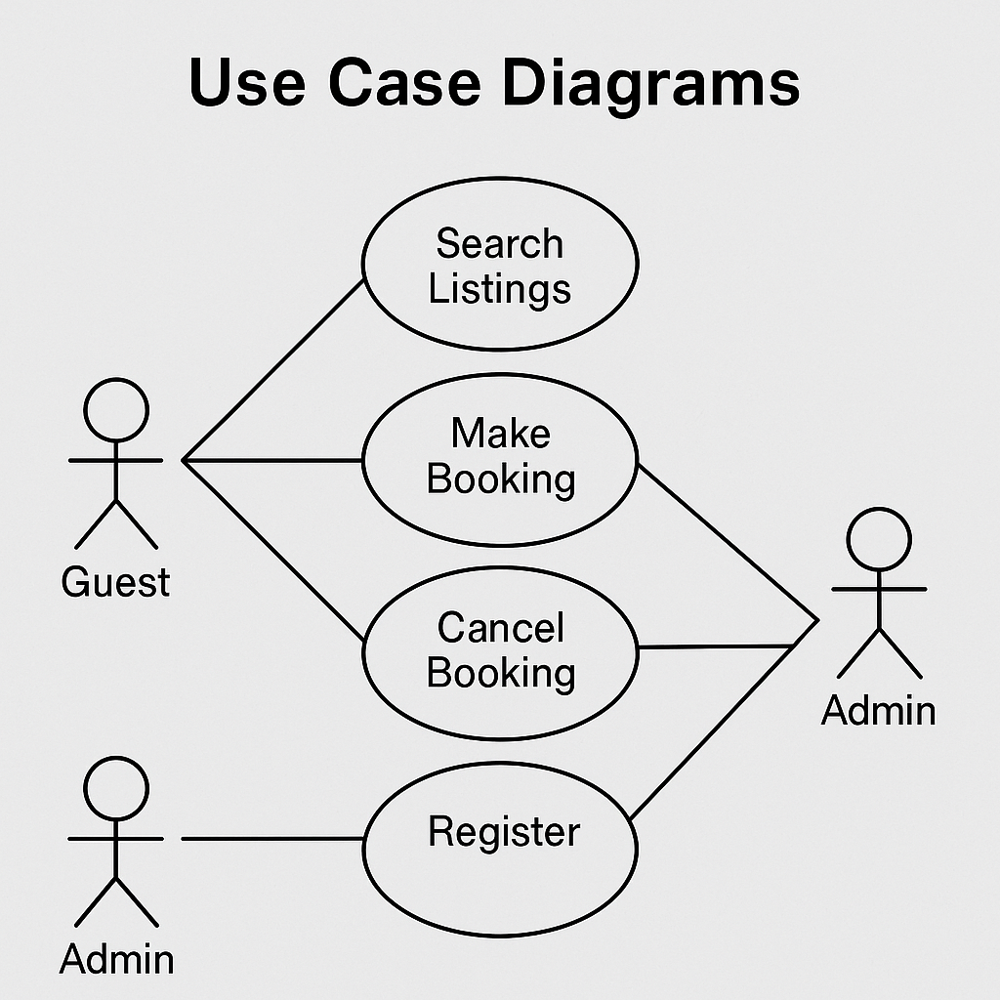

# Requirement Analysis in Software Development

## Introduction
This repository serves as a comprehensive overview of Requirement Analysis in the Software Development Lifecycle (SDLC). It provides detailed insights, examples, and artifacts that demonstrate how effective requirement analysis improves project success, reduces rework, and ensures alignment with user needs.

## What is Requirement Analysis?
Requirement Analysis is the process of identifying, gathering, analyzing, and documenting the needs and expectations of stakeholders for a new or modified product. It is a foundational activity in the SDLC that ensures the final product aligns with user and business needs.

It typically includes gathering functional and non-functional requirements, validating them, and ensuring they are understood by all parties involved. This process reduces project risks, improves clarity, and provides the basis for design, development, and testing.

## Why is Requirement Analysis Important?
- **Reduces Development Errors:** Helps prevent misunderstanding or overlooking important functionalities.
- **Improves Communication:** Aligns stakeholders, developers, and clients through a shared understanding of requirements.
- **Saves Time and Cost:** Early clarity reduces scope creep and costly rework during development.

## Key Activities in Requirement Analysis
- **Requirement Gathering:** Collecting information from stakeholders and users.
- **Requirement Elicitation:** Using interviews, surveys, and workshops to extract user needs.
- **Requirement Documentation:** Structuring requirements into clear and readable documents.
- **Requirement Analysis and Modeling:** Structuring and analyzing requirements using models like use cases or data flow diagrams.
- **Requirement Validation:** Verifying requirements are complete, consistent, and feasible.

## Types of Requirements

### Functional Requirements
Functional requirements describe what the system should do. For the booking management system, examples include:
- A user can search for available bookings by date and location.
- A host can create, update, and delete their listings.
- A guest can confirm and pay for a booking.

### Non-functional Requirements
Non-functional requirements describe how the system performs tasks. For the booking management system, examples include:
- The system should load the booking page in less than 3 seconds.
- The payment system must comply with PCI-DSS standards.
- The platform must support at least 1000 concurrent users.

## Use Case Diagrams
Use Case Diagrams visually represent interactions between users (actors) and system functionalities (use cases). They help clarify system scope and requirements.

_Actors: Guest, Host, Admin_  
_Use Cases: Search Booking, Make Payment, Create Listing, Cancel Booking, Update Profile, Manage Users_

## Acceptance Criteria
Acceptance Criteria define specific conditions under which a feature is considered complete and acceptable.

**Example: Checkout Feature**  
- The user can view a summary of the booking.
- The user can enter and validate payment information.
- The system processes the payment and confirms the booking.
- A confirmation email is sent to the user.
- All required fields must be filled before checkout is enabled.

These criteria ensure features meet functional goals and user expectations.